# Issue #97 visual comparison

Honor CLK-LX2 (Android 14), captured from `main` and `feature/issue-97-calm-color-system`.

| Surface | Before | After |
| --- | --- | --- |
| Home — light | 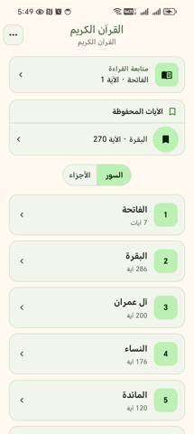 | 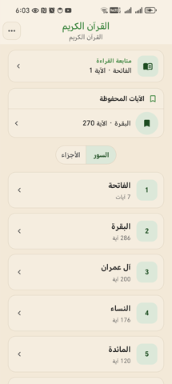 |
| Home — dark | 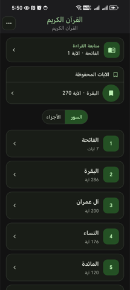 | 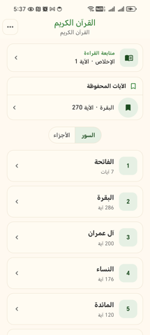 |
| Menu — light | 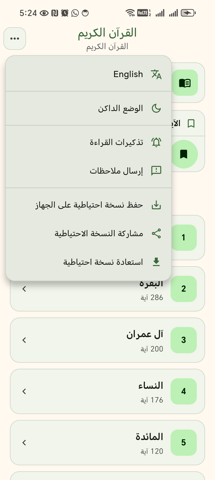 | 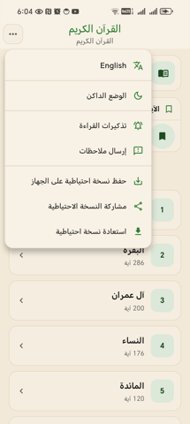 |
| Menu — dark | 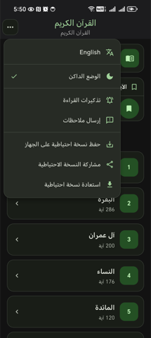 | 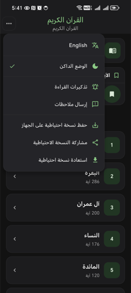 |
| Classic — light | 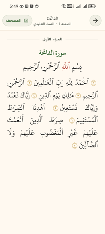 | 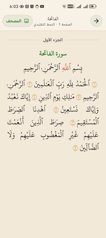 |
| Classic — dark | 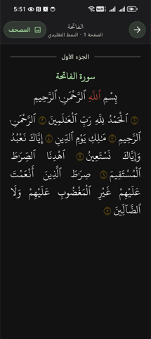 | 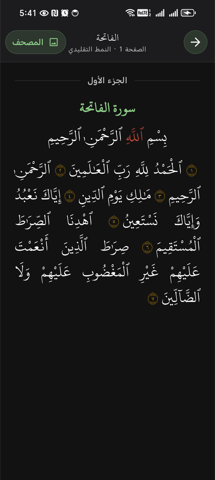 |
| Mushaf — light | 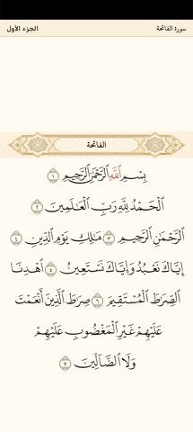 | 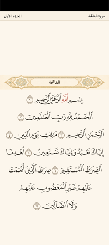 |
| Mushaf — dark | 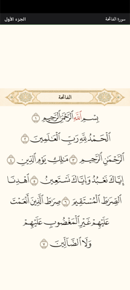 | 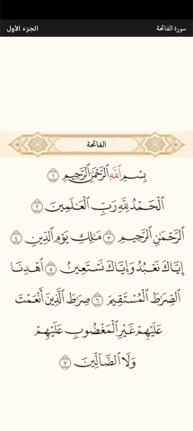 |
